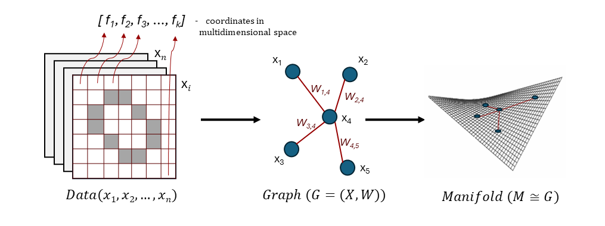

<!-- 
---
mathjax: true
---
-->

# Manifold Und Learning - MANUL

**MANUL** - tool for extracting topology from data as a graph structure and performing manifold regularization for improving 
the quality of machine learning tasks solving.

## How does it works?

We present data as the graph $G_n = (X, W)$, where vertices $X = (x_1, ..., x_n)$ are the data records (points) and $W_{ij}$ is the distance between two data points.

Geometry search is iterative process of distances matrix optimization. Compact neural network has number of degrees of freedom 
which correspond intrinsic dimensionality of data (more about dimensionality estimation in the [example](utils/local_pca_implementation.py)).  

Associated with 
distances matrix mapping acts as an input to the compact model. Inference demonstrate **how good is model's approximation 
of the mapping**. Near-zero loss confirms that intrinsic structure is obtained and such topology can be future used as regularization
component for task-specific models.

### Optimization process
MANUL implements two methods for optimizing the distance matrix:  gradient-based **Adam** and evolutionary **Eva**.

- **[Adam](Adam)** - include end-to-end differentiable Isomap method for manifold learning. In this case, 
the distance matrix acts as weights trained over epochs using the built-in tools of PyTorch Autograd.

- **[Eva](Eva)** 🛠️ *(in-progress)* - interprets the distance matrix as the genetic code of each individual graph. 
It implements mutation and crossover operators for graphs, and population evolution preserves 
individuals whose mapping is best approximated by a compact neural network model.

### Manifold regularization

Manifold regularization allows to train a smooth machine-learning model on a found manifold. 
To formulate the neighborhood graph learning problem, the manifold regularization formulation could be extended to:

$$L^* = \min \limits_{G_n \in \mathcal{G}} \left[\min \limits_{f \in H_k} \mathcal{L}(f)+\lambda(f^T l(G_n) f) \right]$$

The Dirichlet energy term \( E_{G_n}(f) = f^T L(G_n) f \) now depends on the distance graph \( G_n \), which is subject to minimization.
We are looking for a graph that minimizes the energy value for a given manifold regularization problem.

