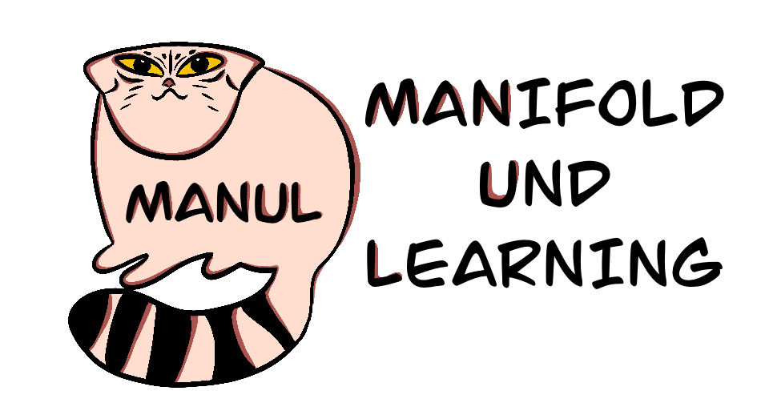

**MANUL** - tool for extracting topology from data as a graph structure 
and associated model regularization. Application assume new approach
to build the neighborhood graph in an initial feature space.

.. image::docs/img/ds_to_graph_scheme.png
    :alt: The scheme with transition from data points with features to topologies structure data

Evolutionary algorithm extract geometry and topology from the data and a specific model. It is used as alternative 
to Euclidean metric for graph building with further graph distillation to avoid 
complex structures.

How to use
===========

1. Import classes with evolution, graph structure and NN model.

.. code-block:: python
    from evolution.Evolution import Evolution
    from evolution.IndividStructures import DataStructureGraph
    from regularizator.ModuleNN import ModelNN 

2. 
