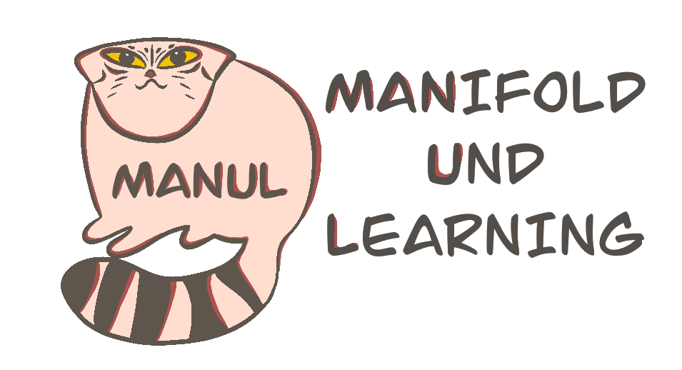
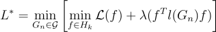

=============================
Manifold Und Learning - MANUL
=============================

**MANUL** - tool for extracting topology from data as a graph structure and associated model regularization. Application employs novel approach to build the neighborhood graph in the initial feature space.

Evolutionary algorithm extracts geometry and topology from the data, using the specific machine learning model. It is used as alternative 
to Euclidean metric for graph building with further graph distillation to avoid unnecessarily complex structures.

Background
==========

In that tool data represents as the graph :math:`G_n = (X, W)`, where vertices :math:`X = (x_1, ..., x_n)` are the data records (points) and :math:`W_{ij}` is the distance between two data points.

.. image:: docs/img/ds_to_graph_scheme.png
    :alt: The scheme with transition from data points with features to topologies structure data

As background for our method, we will use manifold regularization. It allows one to train a smooth machine-learning model on a found manifold.
To formulate the neighborhood graph learning problem, the manifold regularization formulation could be extended to:

How to use
===========

1.  Import classes with evolution, graph structure and NN model:

    .. code-block:: python

        from evolution.Evolution import Evolution
        from evolution.IndividStructures import DataStructureGraph
        from regularizator.ModuleNN import ModelNN 

2.  Create initial graph (for that using meta parameters with number of neighbors and epsilon neighborhood).
    Also in block shows methods for drawing graph in 3d and 2d spaces. 
    ``train_features`` and ``train_target`` is ``numpy.ndarray()``:

    .. code-block:: python

        base_individ = DataStructureGraph(data=train_features,
                                        n_neighbors=10,
                                        epsilon_neighborhood=0.18)

        base_individ.show_3d(labels=train_target, title='Before evolution')
        base_individ.show_2d(labels=train_target, euclidean=True)
    
3.  Create a model for learning. The field ``problem`` can be next values: ``'regres'``, ``'binary_class'`` and ``'multiclass'``.

    .. code-block:: python

        model = ModelNN(train_features[base_individ.basis], train_target[base_individ.basis],
                            num_epochs=50,
                            batch_size=300,
                            problem='regres')

    The variable ``model`` has the following base methods:
        - ``model.train()`` to run NN-model training with or without graph;
        - ``model.get_loss_on_train()`` for getting loss on the train data;
        - ``model.get_loss_on_test(test_features, test_target)`` for getting loss in test data.

4.  Create evolution's object with constructed initial graph and model for searching best structure of data.
    You can choose kinds of mutations on that step.

    .. code-block:: python

        evolution = Evolution(base_individ=base_individ,
                                iterations=30,
                                population_size=7,
                                model_to_optimize=model,
                                base_mutation=True,
                                edges_mutation=True,
                                edges_weight_mutation=True)

    Than you can run evolution and draw convergence plot.

    .. code-block:: python

        evolution.run()
        evolution.plot_evolution_fitnesses()

    The finished graph is kept in field ``base_individ`` and you can draw the resulting graph.

    .. code-block:: python

        evolution.base_individ.show_3d(train_target, title='After evolution')
        evolution.base_individ.show_2d(train_target, euclidean=True)

Examples
========

Folder ``examples`` contains:
    - ``examples/mammonth``: example data, that have shape of mammoth in 3d space, problem - regression;
    - ``examples/mnist_with_augmentation``: examples for MNIST datasets with augmentation (different angle of rotation), problems - binary and multi-class classifications
        for getting of augmentation MNIST dataset on locale you need to run ``examples/mnist_with_augmentation/mnist_augmentation.py``;
    - ``examples/openml``: experiments with all data from OpenML resource by kind of problem (regression, multi-class or binary classification).
